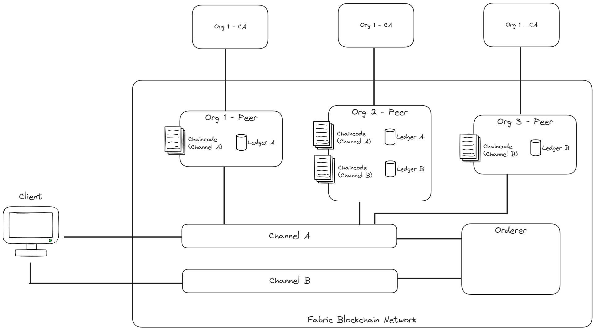
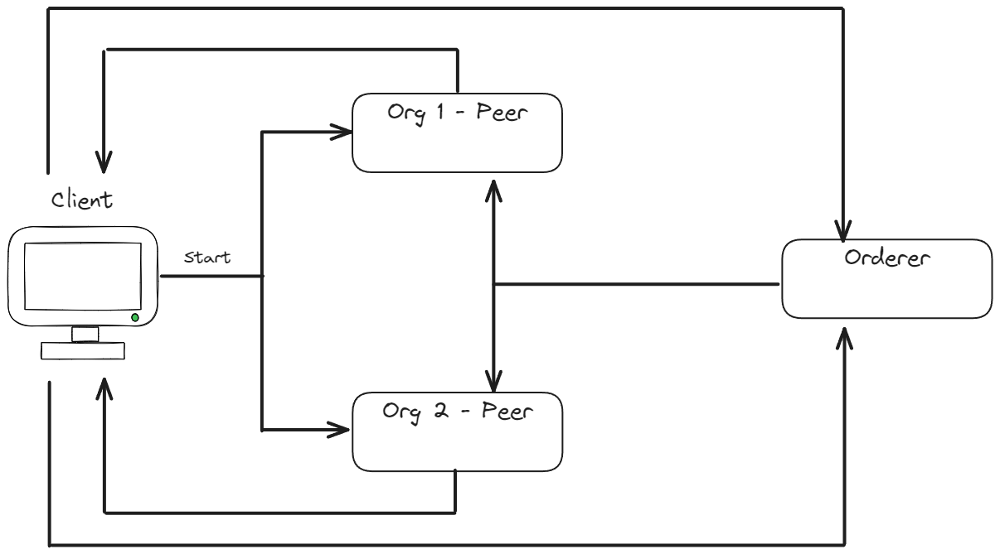
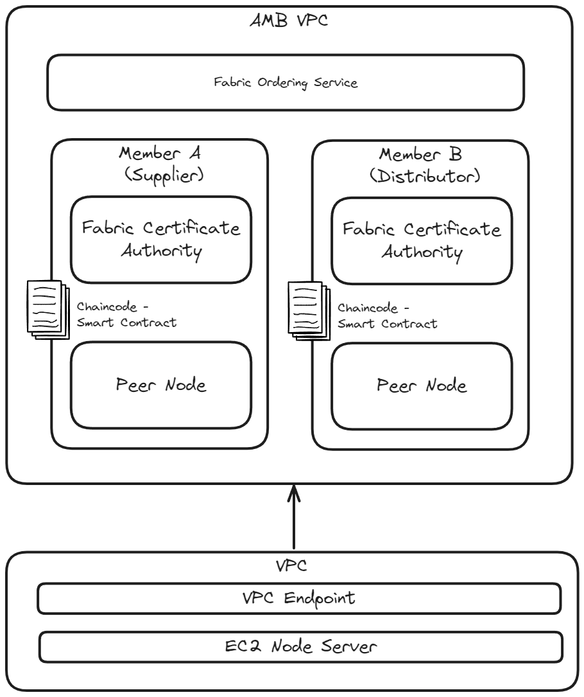

# DL-app

## Technical Concepts

The project features a AWS hosted HyperLedger Fabric blockchain of a coffee bean supply chain. To understand the implementation
of the project, there are a few key concepts that need to be covered. These are useful for the individual who have not
touched distributed ledgers, HyperLedger Fabric or the blockchain before.

### Distributed Ledger

A distributed ledger is a database that is consensually shared and synchronized across 
multiple sites, institutions, or geographies, accessible by multiple people.

What makes it so useful can be summarized in the following characteristics:

- Shared
- Distributed
- Append Only
- Immutable

### HyperLedger Fabric

Hyperledger Fabric platform is an open source **_PERMISSIONED_** blockchain framework hosted by The Linux Foundation.

#### Architecture

Hyperledger Fabric has a complex development architecture and an even more complex production architecture. For this
reason this guide will outline just the basic developmental architecture. 



The HyperLedger Fabric contains the following elements:

- **Client:** Used to communicate with the peers in the network
- **Organization:** The company who will form part of the blockchain. In this example they are represented as
peers, but in reality one organization can have many peers.
- **Peer:** A node in the network. Each node contains chaincode and ledgers (system and channel). 
- **Orderer:** Unbiased, non-malicious node that forms part of the network. Handles the insertions of transactions for an unbiased approach.
- **Channel:** A private “subnet” of communication between two or more specific network members, for the purpose of conducting private and confidential transactions.
- **Chaincode:**: Used to create smart contracts and typically handles business logic agreed to by members of the network
- **CA**: Certificate Authority. Because Fabric is a permissioned blockchain, CA's are used identify allowed peers in the network. 

#### The Consensus in Hyperledger Fabric

Hyperledger Fabric uses a permissioned voting-based consensus which assumes that all participants 
in the network are partially trusted. This gets rid of the expensive proof-based-on-work approach that
public blockchains rely on.

The typical flow of a consensus is as follows:


1. Client proposes a transaction, signs the transaction with the certificate and sends the transaction
to a set of pre-defined endorsing peers on a channel.
2. Each peer verifies the identity and simulates the transaction if verification passes. The peer will then
sign the endorsement with their own certificate and return it to the client.
3. The client then sends the transaction with the endorsement from the peers to the Orderer to process.
4. The order then generates a block of ordered transactions and signs the block with its certificate.
Lastly the Orderer will broadcast the generated block to all peers on the relevant channels. Each peer does some checks
to make sure the block is actually from the correct sources with correct endorsements and then update its ledgers.

Note: The client receives the subscribed events.

## Implementation

### Outline

As mentioned before, this specific implementation features a coffee bean supply chain. There are
four companies involved:

- Origin: Green Valley Farm
- Processing: Ethiopian Coffee Processing Ltd.
- Packaging: Global Coffee Packers Inc.
- Shipment: International Shippers Co.

This is what a typical object looks like in the system:
```js
{
    ItemID: "1",
    ItemName: "Organic Fair-Trade Arabica Coffee Beans",
    Origin: {
        Farm: "Green Valley Farm",
        OriginLocation: "Ethiopia",
        Certifications: [
            "Organic",
            "Fair Trade"
        ],
        HarvestDate: "2024-04-15"
    },
    Processing: {
        Processor: "Ethiopian Coffee Processing Ltd.",
        ProcessingLocation: "Addis Ababa, Ethiopia",
        ProcessDate: "2024-04-20",
        ProcessType: "Wet Processing"
    },
    Packaging: {
        Packager: "Global Coffee Packers Inc.",
        PackagingLocation: "Nairobi, Kenya",
        PackageDate: "2024-04-25",
        PackageType: "Eco-friendly Bags"
    },
    Shipment: {
        Shipper: "International Shippers Co.",
        ShipmentID: "SHIP987654321",
        Origin: "Nairobi, Kenya",
        Destination: "New York, USA",
        DepartureDate: "2024-05-01",
        ArrivalDate: "2024-05-10",
        Status: "Shipped"
    },
    CurrentOwner: {
        Entity: "Coffee Distributors USA",
        OwnerLocation: "New York, USA",
        ReceivedDate: "2024-05-10"
    },
    TransactionHistory: [
        {
            TransactionID: "TXN12345",
            Timestamp: "2024-04-15T08:30:00Z",
            From: "Green Valley Farm",
            To: "Ethiopian Coffee Processing Ltd.",
            Details: "Harvested and sent for processing"
        },
        {
            TransactionID: "TXN12346",
            Timestamp: "2024-04-20T10:00:00Z",
            From: "Ethiopian Coffee Processing Ltd.",
            To: "Global Coffee Packers Inc.",
            Details: "Processed and sent for packaging"
        },
        {
            TransactionID: "TXN12347",
            Timestamp: "2024-04-25T15:00:00Z",
            From: "Global Coffee Packers Inc.",
            To: "International Shippers Co.",
            Details: "Packaged and sent for shipment"
        },
        {
            TransactionID: "TXN12348",
            Timestamp: "2024-05-10T12:00:00Z",
            From: "International Shippers Co.",
            To: "Coffee Distributors USA",
            Details: "Shipped and received"
        }
    ]
}
```

### AWS Architecture

AWS has a service called Amazon Managed Blockchain (AMB). The service implement a Hyperledger 
Fabric architecture. The general flow of Hyperledger Fabric still applies in AMB.

The architecture of the Coffee Bean Supply chain looks as follows:




### Functionality

When it comes to what you can do in the coffee bean supply, it all boils down to CRUD.
Each organisation in the supply chain can update their specific sections of the process, so 
that the asset will give an accurate reading of the chain of supply that was followed. 

The state is represented by the object mentioned above and CRUD operations are performed on 
that object.

In basic summary it includes the following:

- Create Asset
- Fetch Specific Asset
- Update Asset
- Delete Asset
- Transfer Asset
- Get All Asset
- Get Asset History

The EC2 Node Server has endpoints that exposes this functionality. In here the `fabric-network`
node sdk package is used to communicate with the network.

### Chaincode on the Peers

Hyperledger Fabric makes use of chaincode to tell the peers how to manage assets. By default, a 
peer won't understand what it means to 'transfer an asset', so it is up to the implementer to 
define all of these relationships and functionality.

In the Coffee Bean Supply Chain, a node chaincode/smartcontract is used to implement that logic.

This is a code snippet of a chaincode:

```javascript
    // TransferAsset updates the owner field of asset with given id in the world state.
    async TransferAsset(
        ctx, 
        itemID, 
        newOwner = {Entity, OwnerLocation, ReceivedDate},
        transferTransaction = {TransactionID, Details}
    ) {
        const exists = await this.AssetExists(ctx, itemID);
        if (!exists) {
            throw new Error(`The asset ${itemID} does not exist`);
        }
        newOwner = JSON.parse(newOwner);
        if (this.HasCorrectKeys(newOwner)) {
            const assetString = await this.ReadAsset(ctx, itemID);
            const asset = JSON.parse(assetString);
            asset.TransactionHistory.push({
                TransactionID: transferTransaction.TransactionID,
                Timestamp: (new Date()).toISOString(),
                From: asset.CurrentOwner.Entity,
                To: newOwner.Entity,
                Details: transferTransaction.Details
            });
            asset.CurrentOwner = newOwner;
            return ctx.stub.putState(itemID, Buffer.from(JSON.stringify(asset)));
        }
        else { 
            throw new Error(`Incorrect parameter structure.`);
        }
    }
```

## Further Readings

For further readings and explanations, you can refer to the resources below:

- [Hyperledger Fabric Documentation](https://hyperledger-fabric.readthedocs.io/)
- [Telusko Summary Video](https://www.youtube.com/watch?v=rwKPXHUlmks)